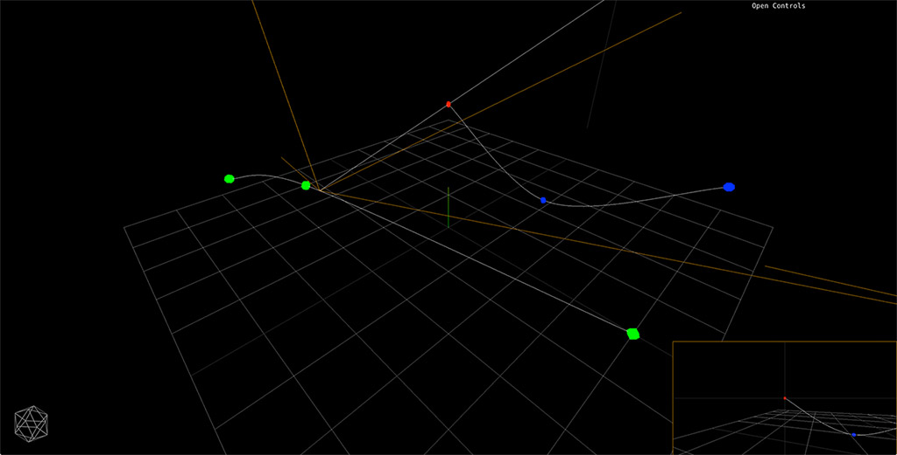

# Threejs Camera Dolly

When dealing with camera animation in [threejs](http://threejs.org) it's difficult to control both camera and lookat positions with precision.

This helper was created to solve this problem by using one path for the camera and another for it's lookat.

Path positions can be exported to JSON and loaded back in.

Try the interactive [demo](http://davidpaulrosser.github.io/threejs-camera-dolly/).

This helper was created for [VOID](http://void.hi-res.net), an interactive webgl experience by [Hi-ReS!](http://hi-res.net)
